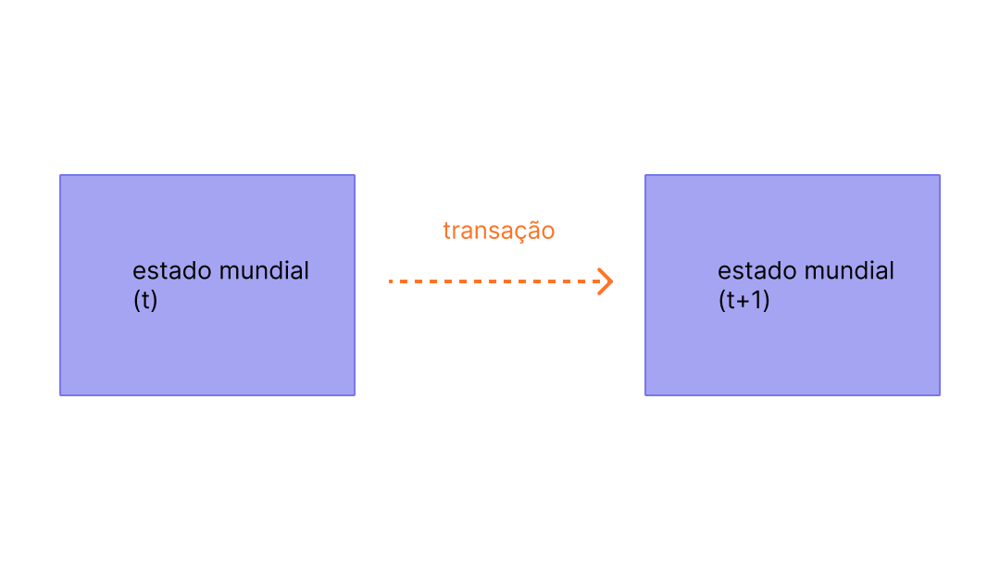
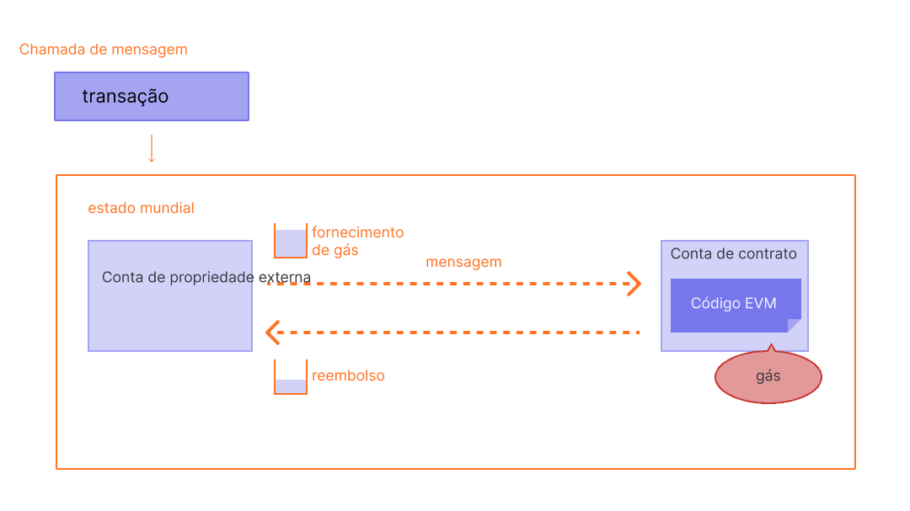

Transações são instruções assinadas criptograficamente de contas. Uma conta iniciará uma transação para atualizar o estado da rede Ethereum. A transação mais simples é transferir ETH de uma conta para outra.

## Pré-Requisitos {#prerequisites}

Mas para ajudá-lo a entender melhor esta página, recomendamos que você primeiro leia [Contas](/developers/docs/accounts/), [Transações](/en/developers/docs/transactions/)e nossa [introdução ao Ethereum](/developers/docs/intro-to-ethereum/).

## O que é uma transação? {#whats-a-transaction}

Uma transação Ethereum refere-se a uma ação iniciada por uma conta de propriedade externa, ou seja, uma conta gerenciada por um ser humano, não um contrato. Por exemplo, se Bob enviar a Alice 1 ETH, a conta de Bob deverá ser debitada e a de Alice deverá ser creditada. Esta ação de mudança de estado ocorre no âmbito de uma transação.

 _Diagrama adaptado de [Ethereum EVM ilustrado](https://takenobu-hs.github.io/downloads/ethereum_evm_illustrated.pdf)_

Transações que alteram o estado da EVM precisam ser transmitidas para toda a rede. Qualquer nó pode transmitir uma solicitação para que uma transação seja executada na EVM; depois que isso acontecer, um validador executará a transação e propagará a mudança de estado resultante para o restante da rede.

As transações exigem uma taxa e devem ser incluídas em um bloco validado. Para tornar esta visão geral mais simples, cobriremos as taxas de gás e validação em outro lugar.

Uma transação enviada inclui as seguintes informações:

- `from`: o endereço do remetente que assinará a transação. Ela será uma conta de propriedade externa, pois as contas de contrato não podem enviar transações.
- `recipient`: o endereço de recebimento (se for uma conta de propriedade externa, a transação transferirá o valor. Se for uma conta de contrato, a transação executará o código do contrato)
- `signature`: o identificador do remetente. Ele é gerado quando a chave privada do remetente assina a transação e confirma que o remetente autorizou essa transação.
- `nonce`: um contador de incremento sequencial que indica o número da transação a partir da conta.
- `value`: a quantidade de ETH a transferir do remetente para o destinatário (denominado em WEI, onde 1ETH equivale a 1e+18wei).
- `data`: o campo opcional para incluir dados arbitrários.
- `gasLimit`: a quantidade máxima de gás que pode ser consumida pela transação. A [EVM](/developers/docs/evm/opcodes) especifica as unidades de gás necessárias para cada etapa computacional
- `maxPriorityFeePerGas`: o preço máximo do gás consumido a ser incluído como gorjeta para o validador.
- `maxFeePerGas`: a taxa máxima por unidade de gás disposta a ser paga pela transação (inclusive de `baseFeePerGas` e `maxPriorityFeePerGas`)

Gás é uma referência ao cálculo necessário para processar a transação por um validador. Os usuários têm que pagar uma taxa por este cálculo. O `gasLimit` e o `maxPriorityFeePerGas` determinam a taxa máxima de transação paga ao validador. [Mais sobre gás](/developers/docs/gas/).

O objeto da transação ficará um pouco assim:

```js
{
  from: "0xEA674fdDe714fd979de3EdF0F56AA9716B898ec8",
  to: "0xac03bb73b6a9e108530aff4df5077c2b3d481e5a",
  gasLimit: "21000",
  maxFeePerGas: "300",
  maxPriorityFeePerGas: "10",
  nonce: "0",
  value: "10000000000"
}
```

Mas um objeto de transação deve ser assinado usando a chave privada do remetente. Isso prova que a transação só poderia ter vindo do remetente e não foi enviada fraudulentamente.

Um cliente Ethereum como o Geth irá lidar com este processo de assinatura.

Exemplo de chamada [JSON-RPC](/developers/docs/apis/json-rpc):

```json
{
  "id": 2,
  "jsonrpc": "2.0",
  "method": "account_signTransaction",
  "params": [
    {
      "from": "0x1923f626bb8dc025849e00f99c25fe2b2f7fb0db",
      "gas": "0x55555",
      "maxFeePerGas": "0x1234",
      "maxPriorityFeePerGas": "0x1234",
      "input": "0xabcd",
      "nonce": "0x0",
      "to": "0x07a565b7ed7d7a678680a4c162885bedbb695fe0",
      "value": "0x1234"
    }
  ]
}
```

Exemplo de resposta:

```json
{
  "jsonrpc": "2.0",
  "id": 2,
  "result": {
    "raw": "0xf88380018203339407a565b7ed7d7a678680a4c162885bedbb695fe080a44401a6e4000000000000000000000000000000000000000000000000000000000000001226a0223a7c9bcf5531c99be5ea7082183816eb20cfe0bbc322e97cc5c7f71ab8b20ea02aadee6b34b45bb15bc42d9c09de4a6754e7000908da72d48cc7704971491663",
    "tx": {
      "nonce": "0x0",
      "maxFeePerGas": "0x1234",
      "maxPriorityFeePerGas": "0x1234",
      "gas": "0x55555",
      "to": "0x07a565b7ed7d7a678680a4c162885bedbb695fe0",
      "value": "0x1234",
      "input": "0xabcd",
      "v": "0x26",
      "r": "0x223a7c9bcf5531c99be5ea7082183816eb20cfe0bbc322e97cc5c7f71ab8b20e",
      "s": "0x2aadee6b34b45bb15bc42d9c09de4a6754e7000908da72d48cc7704971491663",
      "hash": "0xeba2df809e7a612a0a0d444ccfa5c839624bdc00dd29e3340d46df3870f8a30e"
    }
  }
}
```

- o `raw` é a transação assinada no [Prefixo de Tamanho Recursivo (RLP)](/developers/docs/data-structures-and-encoding/rlp) na forma codificada
- `tx` é a transação assinada no formato JSON

Com o hash da assinatura, a transação pode ser provada criptograficamente de que veio do remetente e enviada para a rede.

### O campo de dados {#the-data-field}

A grande maioria das transações acessa um contrato de uma conta de propriedade externa. A maioria dos contratos é escrita em Solidity e interpreta seus campos de dados de acordo com a [interface binária do aplicativo (ABI)](/glossary/#abi).

Os primeiros quatro bytes especificam qual função chamar, usando o hash do nome e dos argumentos da função. Às vezes, você pode identificar a função do seletor usando [este banco de dados](https://www.4byte.directory/signatures/).

O restante dos dados da chamada são os argumentos, [codificado conforme especificado nas especificações ABI](https://docs.soliditylang.org/en/latest/abi-spec.html#formal-specification-of-the-encoding).

Por exemplo, vejamos [esta transação](https://etherscan.io/tx/0xd0dcbe007569fcfa1902dae0ab8b4e078efe42e231786312289b1eee5590f6a1). Use **Clique para ver mais** para conferir os dados de chamada.

O seletor de função é `0xa9059cbb`. Existem várias [funções conhecidas com esta assinatura](https://www.4byte.directory/signatures/?bytes4_signature=0xa9059cbb). Nesse caso, [o código-fonte do contrato](https://etherscan.io/address/0xa0b86991c6218b36c1d19d4a2e9eb0ce3606eb48#code) foi carregado para o Etherscan, então sabemos que a função é `transfer(address, uint256)`.

O resto dos dados é:

```
0000000000000000000000004f6742badb049791cd9a37ea913f2bac38d01279
000000000000000000000000000000000000000000000000000000003b0559f4
```

De acordo com as especificações da ABI, valores inteiros (como endereços, que são inteiros de 20 bytes) aparecem na ABI como palavras de 32 bytes, preenchidos com zeros na frente. Portanto, sabemos que o endereço `para` é [`4f6742badb049791cd9a37ea913f2bac38d01279`](https://etherscan.io/address/0x4f6742badb049791cd9a37ea913f2bac38d01279). O `valor` é 0x3b0559f4 = 990206452.

## Tipos de transações {#types-of-transactions}

No Ethereum existem alguns tipos diferentes de transações:

- Transações regulares: uma transação de uma conta para outra.
- Transações de implantação do contrato: uma transação sem um endereço 'para', onde o campo de dados é usado para o código do contrato.
- Execução de um contrato: uma transação que interage com um contrato inteligente implantado. Nesse caso, o endereço "para" é o endereço do contrato inteligente.

### Sobre gás {#on-gas}

Como mencionado, as transações custam [gás](/developers/docs/gas/) para serem executadas. Transações de transferência simples requerem 21.000 unidades de gás.

Então para Bob enviar a Alice 1 ETH para `baseFeePerGas` de 190 gwei e `maxPriorityFeePerGas` de 10 gwei, Bob precisará pagar a seguinte taxa:

```
(190 + 10) * 21000 = 4.200.000 gwei
--ou--
0,0042 ETH
```

A conta de Bob será debitada **-1,0042 ETH** (1 ETH para Alice + 0,0042 ETH em taxas de gás)

A conta de Alice será creditada **+1,0 ETH**

A taxa base queimará **-0,00399 ETH**

O validador mantém a gorjeta de **+0,000210 ETH**

É necessário gás para qualquer interação de contrato inteligente também.

 _Diagrama adaptado do [Ethereum EVM ilustrado](https://takenobu-hs.github.io/downloads/ethereum_evm_illustrated.pdf)_

Qualquer gás não usado em uma transação é reembolsado para a conta do usuário.

## Ciclo de vida de transação {#transaction-lifecycle}

Quando uma transação é enviada, acontece o seguinte:

1. Um hash de transação é gerado criptograficamente: `0x97d99bc7729211111a21b12c933c949d4f31684f1d6954ff477d0477538ff017`
2. A transação é então transmitida para a rede e adicionada a um pool de transações que compreende todas as outras transações de rede pendentes.
3. Um validador deve escolher sua transação e incluí-la em um bloco para verificar a transação e considerá-la "bem-sucedida".
4. Com o passar do tempo, o bloco que contém sua transação será atualizado para "justificado" e depois "finalizado". Essas atualizações tornam muito mais certo de que sua transação foi bem-sucedida e nunca será alterada. Uma vez que um bloco é “finalizado”, ele só poderá ser alterado por um ataque na rede que custe muitos bilhões de dólares.

## Uma demonstração visual {#a-visual-demo}

Assista Austin mostrar as transações, gás e mineração.

<YouTube id="er-0ihqFQB0" />

## Envelope de transação digitado {#typed-transaction-envelope}

O Ethereum originalmente tinha um formato para transações. Cada transação possuía um emissor, custo de "queima", parâmetro de "queima", endereçamentos, valores, dados, v, r, e s. Esses campos são [codificados por RLP](/developers/docs/data-structures-and-encoding/rlp/), podendo se parecer com isto:

`RLP ([emissor, taxa de "queima", parâmetros de "queima", destino, valor, dados, v, r, s])`

O Ethereum evoluiu para apoiar vários tipos de transações, permitindo que novos recursos, como listas de acesso e [EIP-1559](https://eips.ethereum.org/EIPS/eip-1559) sejam implementados sem que isso afete os formatos de transação herdados.

[EIP-2718](https://eips.ethereum.org/EIPS/eip-2718) é o que permite esse comportamento. Transações são interpretadas como:

`TransactionType || TransactionPayload`

Onde os campos são definidos como:

- `TransactionType`: um número entre 0 e 0x7f, para um total de 128 tipos de transações possíveis.
- `TransactionPayload`: um array de bytes arbitrário definido pelo tipo de transação.

## Leitura adicional {#further-reading}

- [EIP-2718: Typed Transaction Envelope](https://eips.ethereum.org/EIPS/eip-2718)

_Conhece um recurso da comunidade que o ajudou? Edite esta página e adicione-a!_

## Tópicos relacionados {#related-topics}

- [Contas](/developers/docs/accounts/)
- [Máquina virtual de Ethereum (EVM)](/developers/docs/evm/)
- [Gás](/developers/docs/gas/)
